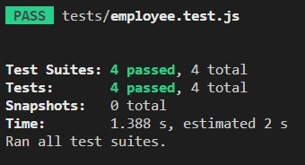

# Team Profile Generator

   ## Description
   A Generator that will create your teams profile for you. You can view my walkthrough video <a href="https://drive.google.com/file/d/1DP5YwStIaNxB8xPiJ0fq8HpQtqRNQvms/view" target="_blank">here.</a>
   
   ## Table of Contents
   - [Description](#description)
   - [Installation](#installation)
   - [Tests](#tests)
   - [Credits](#credits)
   - [Badge](#badge)

   ## Installation
   npm i and npm i jest, once that is done run node index.js to run the generator.

   ## Tests
  
   
   

   ## Credits
   The Mini project and various other activities from Module 10

   ## Badge
   MIT License: 
